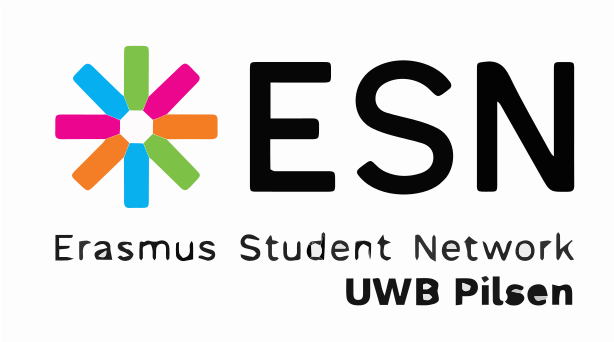

# ESN UWB Pilsen - Official Website

This is the central web platform for the Erasmus Student Network (ESN) at the University of West Bohemia in Pilsen. It serves incoming international students and local students interested in the Buddy System.



## 🚀 Tech Stack

- **Framework**: [Next.js 16](https://nextjs.org/) (App Router)
- **Styling**: [Tailwind CSS v4](https://tailwindcss.com/)
- **CMS (Content Management System)**: [Outstatic v2.0](https://outstatic.com/)
- **Language**: TypeScript
- **Fonts**: Kelson Sans (Local / Brand Heading), Lato (Google Fonts / Body)
- **Icons**: Lucide React

## 💻 Getting Started (Development)

### Prerequisites
- Node.js (v20+ recommended)
- GitHub Account for CMS Access

### Installation

1. **Clone the repository:**
   ```bash
   git clone https://github.com/Zephyron-Tech/esn-uwb-web.git
   cd esn-uwb-web
   ```

2. **Install dependencies:**
   ```bash
   npm install
   ```
   *(Note: There is an explicit `overrides` section in `package.json` to handle peer dependency conflicts between Outstatic, Next.js 16, and Tailwind CSS v4. Do not remove this unless Outstatic releases an official patch).*

3. **Environment Setup for CMS:**
   Copy the example environment file:
   ```bash
   cp .env.example .env.local
   ```
   Fill in the required GitHub credentials in `.env.local`:
   ```env
   OST_GITHUB_ID=your_oauth_app_client_id
   OST_GITHUB_SECRET=your_oauth_app_client_secret
   OST_TOKEN_SECRET=a_secure_random_32_character_string
   OST_REPO_SLUG=esn-uwb-web
   OST_REPO_OWNER=Zephyron-Tech
   OST_REPO_BRANCH=develop # Always target develop for non-production environments
   ```

4. **Run the development server:**
   ```bash
   npm run dev
   ```
   Open [http://localhost:3000](http://localhost:3000) to view the site.

## 📝 Content Management (Outstatic CMS)

This website uses **Outstatic**, a Git-based CMS that stores data directly in the repository as Markdown files inside `outstatic/content/`.

### How to use the CMS:
1. Navigate to `http://localhost:3000/outstatic` (or your production URL `/outstatic`).
2. Log in using your GitHub account.
3. Manage content across 4 primary collections:
   - **News**: Articles and announcements shown on the homepage and `/news`.
   - **Board Members**: Profiles displayed on the `/about-us` page.
   - **Guides**: Downloadable PDFs displayed on the `/incoming-student` page.
   - **Photos**: Galleries for events and trips on `/gallery`.

*Note: Outstatic does NOT require a database. Every time you publish a post, it commits a markdown file directly to GitHub.*

## 🌐 Branching Strategy & Deployment
- `develop`: Main development branch. All PRs and CMS tests should be targeted here.
- `main`: Production branch used exclusively by the Vercel production server.

To deploy on Vercel, simply connect the GitHub repository to a new Vercel project and ensure the exact same environment variables from `.env.local` are set in the Vercel dashboard.

---
*Developed for ESN UWB Pilsen.*
